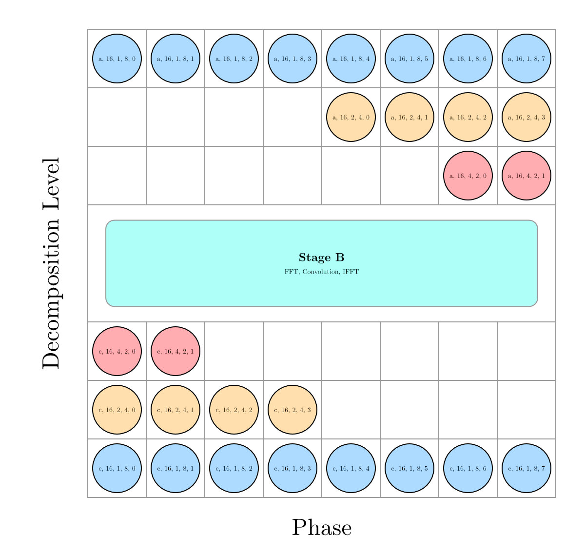
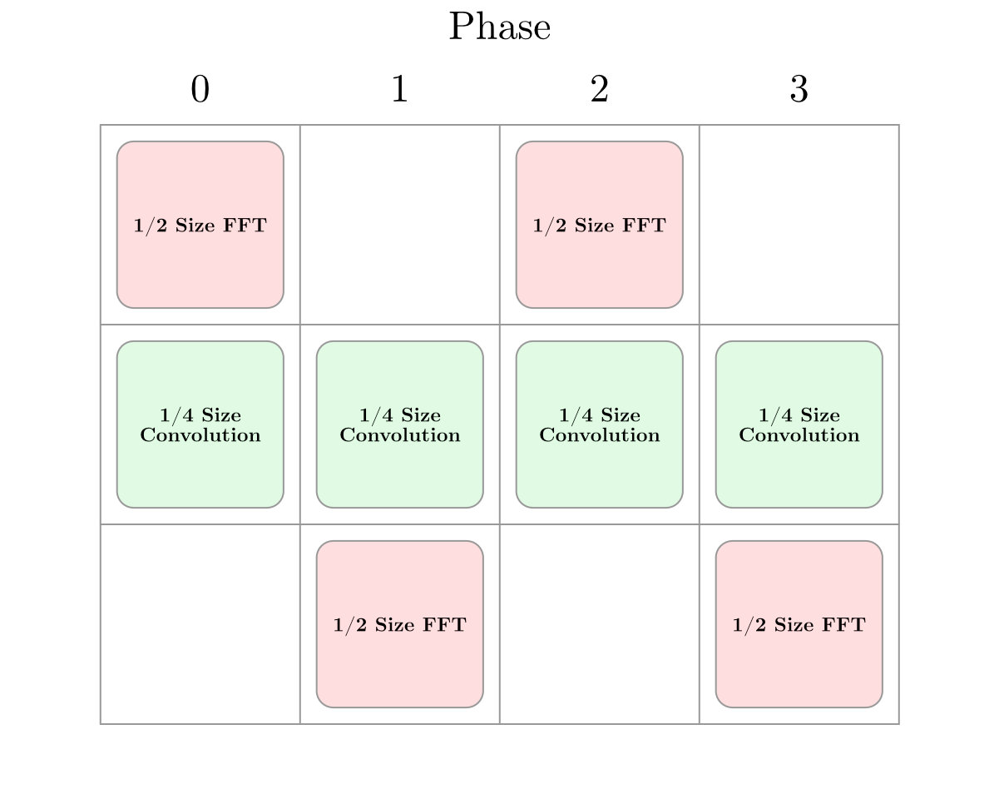
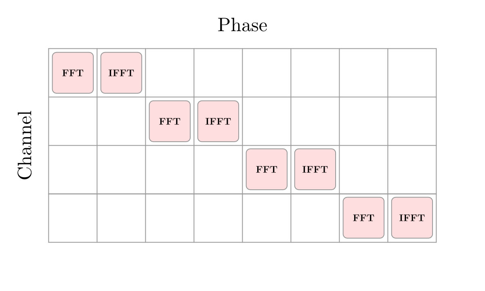
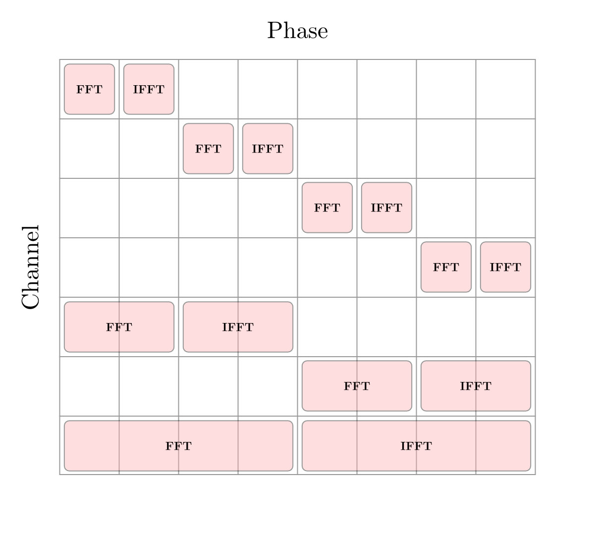

[![Contributors][contributors-shield]][contributors-url]
[![Forks][forks-shield]][forks-url]
[![Stargazers][stars-shield]][stars-url]
[![Issues][issues-shield]][issues-url]
[![MIT License][license-shield]][license-url]


---

<br />
<div align="center">
  <a href="https://github.com/zones-convolution/zones_convolver">
    
  </a>

<h3 align="center">Zones Convolver</h3>

  <p align="center">

## !! Please note: This library has not seen production use. We **DO NOT RECOMMEND** using this yet. !!

Convolution library used in the upcoming Zones Convolution plugin. Implements a non-uniform partitioned convolution (
NUPC) scheme with modified Garcia optimal partitioning and time distributed transforms. This is able to run on a single
thread without large spikes in load for variable block sizes without additional latency.

Currently, the library is in a first draft state and has not yet seen real use. We plan on improving the stability along
with user testing. We expect breaking changes will be introduced as the library evolves.

<br />
<a href="https://github.com/zones-convolution/zones_convolver/issues">Report Bug / Request Feature</a>
</p>
</div>

# Usage

Zones Convolver provides an interface that is able to load IRs offline and then smoothly fade them in/out in a (
hopefully) thread-safe manner. Impulse responses should be loaded only from a thread where a short wait (used to copy
the IR) is acceptable. In the case of the Zones Convolver plugin we have a background thread that loads IRs. This is
required as the convolution engine must allocate space for and copy the IR.

## Convolution Engine

The ```ConvolutionEngine``` class inherits from ```juce::dsp::ProcessorBase``` exposing the ```prepare```, ```reset```
and ```process``` methods. These should be called in their appropriate places. IRs can be loaded through
the ```LoadIR``` method that expects a ```juce::dsp::AudioBlock``` that will be copied.

### Minimal Example

```cpp
#include <zones_convolver/zones_convolver.h>

class MyPluginProcessor : juce::dsp::ProcessorBase
{
private:
    juce::ThreadPool thread_pool_;
    zones::ConvolutionEngine convolver_ {thread_pool_};

public:
    ~MyPluginProcessor () override = default;
    MyPluginProcessor (juce::dsp::AudioBlock<const float> ir_to_load)
    {
        zones::Convolver::ConvolverSpec quad_spec {
          .input_routing = {0, 1, 2, 3},
          .output_routing = {0, 1, 2, 3},
          .fade_strategy = zones::Convolver::FadeStrategy::kCrossfade
        };
        convolver_.LoadIR (ir_to_load, quad_spec);
    }

    void prepare (const juce::dsp::ProcessSpec & spec) override
    {
        convolver_.prepare (spec);
    }

    void process (const juce::dsp::ProcessContextReplacing<float> & replacing) override
    {
        convolver_.process (replacing);
    }

    void reset () override
    {
        convolver_.reset ();
    }
};
```

Though we suggest using the ```ConvolutionEngine``` class, it is also possible to directly use
the ```UniformPartitionedConvolver```
and ```TimeDistributedNUPC``` without mechanisms for loading IRs safely across threads.

# Installation

Zones Convolver is a JUCE module and can be consumed either through CMake or the Projucer. Installation steps are as
follows.

## CMake


```cmake
add_subdirectory(path/to/JUCE)

# Make library available using FetchContent, CPM or simply a submodule

add_subdirectory(path/to/zones_convolver)

target_link_libraries(juce_project
        PRIVATE
        zones_convolver
)
```

## Projucer


Download the library, then go to the module section in Projucer. Click the "+" and "Add a module from a specified
folder...". It can then be included in the header of your project.

# Contributing

We would really welcome any contributions, feel free to open up a PR and we'll review it as soon as possible. The
project largely follows the Google C++ coding style and provides a ```.clang-format``` that should be used.

Currently on our roadmap,

* Radix 4 decompositions and corresponding scheduling
* Real only transforms
* Micro-optimisations across the library
* Multi-threaded NUPC implementation
* Moving away from JUCE to be more flexible in other use cases

# License

Distributed under the MIT License. See `LICENSE` for more information.

# Contact

Feel free to get in touch,

**Leon Paterson-Stephens** - leon@leonps.com

**Micah Strange** - micahstrange16@gmail.com

# Library Introduction

A **PDF** version of this documentation is also provided
here, [Zones Convolver Documentation](resources/zones_convolver_documentation.pdf).

Uniform partitioned convolvers (UPC) are able to evenly distribute load as all operations needed for the entire
convolution including their required transforms, are completed in a single process call.
For larger filter sizes, it can be beneficial to employ non-uniform partitioned convolution (NUPC).
In these schemes, larger partitions are required to deliver the results of convolution at an interval of the partition's
size, not the block size/latency that the real-time callback is being run at. This can be problematic regarding
load-distribution, particularly in the case of real-time audio plugins which are block based and conventionally limited
to a single thread.

## Schemes for NUPC

A simple approach to implementing NUPC may be to process entire partitions in a single block at their respective
intervals.
However, this can be problematic when processing at lower latencies.
This is because, the entire computation of the forward and inverse transform along with the complex multiplications of
the entire partition are completed in a single frame.
This can yield dropouts in audio.

This is often compounded in schedules with multiple partitions as other partitions deadlines may also land at the same
time and now the computation of that entire partition's FDL, forward and inverse transform is also computed in that same
frame. This is along with the computation of the uniform convolver running on every block to achieve minimal latency.

Optimal partitioning schemes commonly include upper partition sizes of 65,536 samples for larger filters. These
partitions use FFTs of twice the partition's size. The computation of the different partitions in the NUPC is not equal,
each have their own FFT and FDL size along with deadlines for when each partition should deliver it's convolved samples.

Selecting schemes with longer clearances gives more time for computation. Whilst this may not be as optimal as schemes
closer to Canonical partitioning, it allows distribution across frames. Alternative popular schemes, such as Gardener
and Garcia partitioning can account for this.

## Approaches to Distributing Load

One potential solution to realising NUPC in real-time is to ensure clearances of at least the partition size allowing
the effective size of each transform in each block to be equal.
The operating systems preemptive multi-threading can then be used to distribute the load of transforms and complex
multiplication over time while still running the UPC in the real-time thread.
Using the operating systems preemptive threading divides arbitrary schemes, without specific implementation effort.
In addition, the use of highly optimised FFT libraries such as FFTW is possible.
This scheme also has challenges to its implementation. For example, scheduling threads and their respective results
safely in real-time and ensuring the results of each partition are available at the right time.

In some contexts (such as web audio/mobile/embedded) the use of multiple threads may be problematic. Furthermore, it is
contentious whether it is appropriate in audio plugins.

An alternative approach to distribute the work is through time-distributed transforms and splitting the complex
multiplications. This is the approach used by this library.
The premise of this is that transforms can be decomposed into smaller independent sub-transforms that can then be
computed independently across multiple process calls.

Decomposing to achieve a well-balanced work load is dependent on a number of factors, which is discussed below.

---

# Implementation Detail

This section will present this libraries approach to a time-distributed NUPC. Each time-distributed NUPC is composed of
a single UPC processing at the block size and multiple time-distributed UPCs (TDUPCs). Each TDUPC can be thought of as
an independent UPC operating at it's own block size, processing a given segment of the filter. The top level of the
convolver is responsible for sequencing results of all the TDUPCs.

TDUPCs are given data as it becomes available, at the rate of process calls. However, are internally processed in three
stages. Stages and phases are used to help simplify decomposition and transform scheduling. This is a similar approach
to that taken by the RTConvolve library, however is able to accommodate varying partition sizes.

## Stages / Phases

Each stage is responsible for different types of work. Stages are promoted when a partition size worth of samples are
collected. Each stage operates over a number of phases directly corresponding to process calls. Stages contain
$(partition size / block size)$ number of phases. For example, a TDUPC operating at 16 times the block size (16B) has
16 phases per stage.
During Stage A, samples are collected and decomposed immediately as they become available. Next, in Stage B, the
sub-transforms and complex multiplications of the frequency-domain delay line (FDL) are performed. Finally, in Stage C,
the inverse decompositions are performed before delivering samples. Intuitively, all phases must be completed before a
stage is promoted. However, all three stages are occurring concurrently every phase, acting on different buffers.

The number of phases is fixed at the partition size due to a number of factors. For small clearances it is required to
wait until a partition size worth of samples is collected. Though the decompositions can be performed across all phases,
stage B still delivers at intervals of the partition size, however can't distribute it's work across all phases as it's
result is required in stage C at an earlier point in time and is then left waiting for samples. Whilst large clearances
can allow distribution of work across more phases, convolved samples are still delivered at an interval of the partition
size therefore within one TDUPC there will occur overlapping work. In theory this could also be balanced however the
same result is achieved applying a delay to the output. Considering this, only schemes with clearances greater than or
equal to the partition size are used.

---

## Stage A/C

In stage A, incoming samples are immediately placed into the stage A buffer where forward decompositions can be started
immediately, in place. This is only possible using decimation in frequency (DIF) decompositions as the first stage of
the butterfly corresponds to the first sample and the $(N/2)^{th}$ sample where the value is known to be zero, due to
the zero padding and 2B transform size.

Half way through the decompositions, when the first level decomposition is completed, there are sufficient samples to
process the next level of the butterfly subdividing the transform further.
This decomposition scheme can continue until the transform is completed.

Inverse decomposition's are performed in Stage C, and are a mirrored version of the forward decomposition's. The cost of
decomposition's in the first phase is the highest and decreases toward the end, this has a benefit of balancing the
uneven load of the forward decomposition's. Similarly to the forward decomposition's, the inverse schedule also delivers
samples in a just in time basis.

Increasing the depth of decomposition begins to yield larger spikes of load at the ends of the decomposition schedule.
This can be seen in Figure 1.
Decomposition work is not free as it involves computing stages of the butterfly just as the FFT does. Furthermore, it
can't make certain optimisations that fully formed FFTs can and therefore should be limited to certain extents as will
be discussed.

<div align="center">
  
  <h4 align="center">Fig 1: Maximally decomposed 8 Phase Schedule</h4>
</div>

### Decomposition Depth

Figure 1 depicts a maximally decomposed 8 phase decomposition schedule. The size of the
transforms are 16B and are decomposed three times across 8 phases. This yields 8 sub transforms of 2B. In this case,
decomposing this far is sub-optimal as the number of resulting transforms (forward and inverse) is double the number of
phases. It would be more optimal to decompose twice leaving 4 sub transforms of 4B allowing 4 forward transforms in the
first 4 phases followed by the remaining 4 inverse transforms in the last 4 phases.

Decomposition is continued until the number of sub-FFTs equals half the number of phases in the schedule. This is to
allow for the cost of forward and inverse transforms to be equal across all phases.

---

## Stage B

Once stage B is reached, the initial large transforms will be composed of several smaller sub-transforms that can now be
distributed across the available phases of stage B.
The number of transforms is determined by the number of decompositions performed in the previous stage. However the
number of complex multiplications is always constant for a given partition size and FDL length ($2*partition size*
fdl size$).

The aim of FFT scheduling is to distribute the total work as evenly as possible across the total phases. The number of
decompositions is chosen such that ideally there is a single transform in each phase.
The number of channels effects the depth of decomposition and where transforms are placed in the schedule.

### Mono distribution

For a single channel, the sub FFTs and IFFTs are performed on alternate phases, and the complex multiplications are
spread evenly across every phase.

<div align="center">
  
  <h4 align="center">Fig 2: 1 channel distribution for a 4B partition</h4>
</div>

This arrangement allows a perfect distribution and is simple to realise.
For a mono distribution the decomposition depth is as follows
$decomposition depth = log_{2}(num phases / 2)$
This results in a number of sub transforms equal to the number of phases.

### Multi-channel distribution

For multiple channels, savings can be made on the amount of work by reducing the number of decompositions, and
interleaving work between channels. For a power of 2 channel count each channel equally occupies less phases. This can
be expanded for other channel counts by finding the highest power of 2 recursively.

<div align="center">
  
  <h4 align="center">Fig 3: 4 channel interleaving for an 8B partition, where the number of transforms per channel is reduced from 8 to 2</h4>
</div>

<div align="center">
  
  <h4 align="center">Fig 4: 7 channel interleaving for an 8B partition. The channels are grouped in 4,2,1</h4>
</div>


Channels are able to share the frequency domain filter even with different FFT schedules as the same frequency domain
representation is achieved irrespective of the sub-transform size.
An area for further research may be applying a similar scheme to interleave multiple TDUPCs.

---

## Handling Block Sizes

Each convolver must be initially prepared with a block size. This is used for finding the optimal partition scheme and
breaking up the filter into different sized partitions.

The handling of block sizes across DAWs varies greatly. In the model of audio plugins a maximum block size is provided,
which is often the block size that is processed. However, smaller block sizes can be presented and this case should be
expected.
This presents a problem for a convolution engine set up to run at a fixed block size.
One approach would be to add latency to allow input samples to be buffered up to the maximum block size. However, this
means that DAWs not processing at the maximum block size do not achieve a minimum latency.
% Furthermore, this approach is not flexible to incoming block sizes frequently changing in size.
The approach taken in this library solves this issue. A similar approach is also found in JUCE's convolver. In this
implementation, the convolution engine is able to run at a fixed internal block size and can handle both larger and
smaller processing block sizes.

### Implementation

The incoming block of data is immediately convolved with the first block within the FDL of the UPC regardless of it's
processing block size. This is achieved through zero padding the input up to the internal block size of the UPC. The
inputs are saved, and the results of convolution are added directly to the output. Subsequent process calls continue to
fill the input buffer and outputs are read with an offset in order to align in time. When the internal block size of the
UPC is reached a complete transform is added to the FDL. The entire FDL is processed at intervals of the block size and
then stored. When block sizes are presented that are greater than the internal block size, the UPC is effectively
processed using multiple subdivisions of the incoming block.
A similar approach is used by the NUPC to allow the TDUPCs to function as normal. The TDUPCs are only processed at
intervals of the internal block size.

### Limitations

This approach can increase workload and decrease distribution of the load of the convolver. For the UPC, a transform of
two times the internal block size is computed every process call, regardless of the processing block size. For example,
if the incoming data is half the internal block size, the total FFT work doubles compared to preparing the convolution
engine to match the incoming block size.
For the TDUPCs, the workload may not be distributed evenly every process call. When the incoming data is half the
internal block size, a previously well distributed TDUPC will now only do work every other call and has less time to
perform it's computation.

---

## Partition Schemes

A modified Garcia partitioning algorithm is used to find optimum layouts for each block size and filter length. These
schemes have been pre-computed and embedded in the library. This is necessary as computing Garcia schemes when presented
with specific configurations would be impractical, especially for large filters. This allows for an approximation of the
Garcia schemes to be found. This approach provides flexibility to modify schemes in the future with developments in
partitioning algorithms.

Embedded schemes are first searched to find the nearest available scheme. Where the filter is longer than the closest
pre-computed scheme, additional partitions are added to the largest partition size. If the filter is shorter, partitions
are removed, including removing entire TDUPCs if necessary. A future improvement for filter lengths above the largest
saved scheme would add additional TDUPCs following Gardener partitioning rules.

The modified Garcia partition scheme has been implemented in python along with a cpp generator used to embed the
partitioning results.

# Acknowledgments / References

<!--- // @formatter:off --->

* **Frank Wefers** - Partitioned convolution algorithms for real-time auralization
* **Jeffrey R. Hurchalla** - A Time Distributed FFT for Efficient Low Latency Convolution
* **Eric Battenberg, Rimas Avizienis** - IMPLEMENTING REAL-TIME PARTITIONED CONVOLUTION ALGORITHMS ON CONVENTIONAL
  OPERATING SYSTEMS
* **Guillermo García** - Optimal Filter Partition for Efficient Convolution with Short Input/Output Delay
* **Graham Barab** - [RTCONVOLVE](https://github.com/grahman/RTConvolve)
* **JUCE** - [juce::dsp::Convolution](https://docs.juce.com/master/classdsp_1_1Convolution.html)
* **Jan Wilczek** - [Fast Convolution: FFT-based, Overlap-Add, Overlap-Save, Partitioned](https://thewolfsound.com/fast-convolution-fft-based-overlap-add-overlap-save-partitioned/#the-convolution-series)
* [Readme Boilerplate](https://github.com/othneildrew/Best-README-Template)

<!--- // @formatter:on --->

[contributors-shield]: https://img.shields.io/github/contributors/zones-convolution/zones_convolver.svg?style=for-the-badge

[contributors-url]: https://github.com/zones-convolution/zones_convolver/graphs/contributors

[forks-shield]: https://img.shields.io/github/forks/zones-convolution/zones_convolver.svg?style=for-the-badge

[forks-url]: https://github.com/zones-convolution/zones_convolver/network/members

[stars-shield]: https://img.shields.io/github/stars/zones-convolution/zones_convolver.svg?style=for-the-badge

[stars-url]: https://github.com/zones-convolution/zones_convolver/stargazers

[issues-shield]: https://img.shields.io/github/issues/zones-convolution/zones_convolver.svg?style=for-the-badge

[issues-url]: https://github.com/zones-convolution/zones_convolver/issues

[license-shield]: https://img.shields.io/github/license/zones-convolution/zones_convolver.svg?style=for-the-badge

[license-url]: https://github.com/zones-convolution/zones_convolver/blob/main/LICENSE
